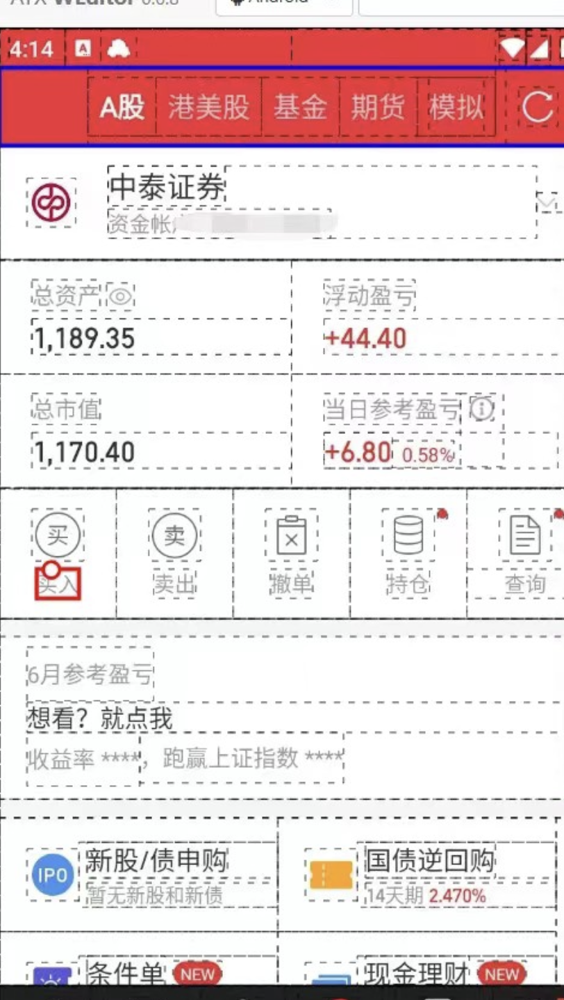

# THSTrader
量化交易工具。同花顺手机版模拟炒股python API，基于uiautomator2和图色方法实现。【可自行扩展到实盘，见最后】


## 为什么有这个项目
本来看到了这个[easytrader](https://github.com/shidenggui/easytrader)这个项目，不过这个客户端已经过时了(被强制更新)。于是乎，自己看了一遍easytrader的源码，写了一个自己的版本。旧版本为PC版本，已经不能用了，如有兴趣请查看[PC同花顺-旧版](https://github.com/nladuo/THSTrader/tree/PC%E5%90%8C%E8%8A%B1%E9%A1%BA-%E6%97%A7%E7%89%88)分支。

## 安装说明
需要Windows系统哈，别的系统可以考虑自己连接安卓真机改一下截图的参数。
### 1. Python依赖
我使用的是Python3.9，以上版本应该也可以。
``` bash
git clone https://github.com/nladuo/THSTrader.git
cd THSTrader
pip install -r requirements.txt
```

### 2. 安装雷电9模拟器
下载链接：[https://res.ldmnq.com/download/leidian9/ldinst_9.0.48.0.exe](https://res.ldmnq.com/download/leidian9/ldinst_9.0.48.0.exe)

### 3. 配置模拟器分辨率
模拟器分辨率我用的是720x1280，320dpi，如需其他分辨率请自行修改代码里的参数。


### 4. 安装同花顺APP
在模拟器上安装同花顺APP，链接：[https://pan.baidu.com/s/1IuoXaOfKgckUTi91hUiqlQ](https://pan.baidu.com/s/1IuoXaOfKgckUTi91hUiqlQ) ，提取码：449w。

安装好之后请登录同花顺APP找到模拟炒股那里保证模拟炒股可以使用，如果不知道怎么操作可以看后面的B站视频。


### 5. 安装配置ADB
首先下载ADB，下载后添加到系统的环境变量中。雷电模拟器也自带了ADB，可以去安装目录下的LDPlayer9下面找到。


## 操作接口（API）
操作演示视频见：[https://www.bilibili.com/video/BV1sX4y147Qe/](https://www.bilibili.com/video/BV1sX4y147Qe/)。咱也不求赞助，如果本项目对你有帮助，请给个B站的关注。


### 测试连接模拟器
首先检查设备，如果是只有一个雷电模拟器的话，一般都是`emulator-5554`这个。
```
adb kill-server
adb devices
```

然后初始化uiautomator2
```
python -m uiautomator2 init
```


### 连接设备
``` python
from THS.THSTrader import THSTrader
trader = THSTrader(r"emulator-5554")    # 连接手机
```

### 获取当前可用资金
``` python
trader.get_balance()
```
返回：
```
{
	'总资产': 199987.96,
	'可用余额': 170632.4,
	'股票市值': 10146.0
}
```
> ** 注意：这里总资产并不是可用余额+股票市值，有一些资金可能代表未成交的金额。 **
### 获取当前持有的股票
说明：获取当前持仓的速度会比较慢，后续需要优化。
``` python
trader.get_position()
```
返回：
```
[{
	'股票名称': '美的集团',
	'股票余额': 100,
	'可用余额': 0
}, {
	'股票名称': '平安银行',
	'股票余额': 200,
	'可用余额': 200
}, {
	'股票名称': '浦发银行',
	'股票余额': 100,
	'可用余额': 100
}, {
	'股票名称': '工商银行',
	'股票余额': 100,
	'可用余额': 100
}, {
	'股票名称': '中国银行',
	'股票余额': 100,
	'可用余额': 100
}]
```
因为A股是T+1，可用余额为当前可以卖出下单的。

### 买入股票
``` python
trader.buy(stock_no="601988", amount=300, price=3.94)
```
返回：
```
{
	'success': True,
	'msg': '委托已提交。合同号为:3549926014',
	'stock_name': '中国银行',
	'amount': '300',
	'price': '3.94',
	'type': '买入'
}
```

### 卖出股票
``` python
trader.sell(stock_no="601988", amount=100, price=4.00)
```
返回：
```
{
	'success': True,
	'msg': '委托已提交。合同号为:3549959358',
	'stock_name': '中国银行',
	'amount': '100',
	'price': '4.0',
	'type': '卖出'
}
```

### 获取当前可撤单列表
说明：获取当前可撤单列表会比较慢，后续需要优化。
``` python
trader.get_avail_withdrawals()
```
返回：
```
[{
	'股票名称': '美的集团',
	'委托价格': 58.33,
	'委托数量': 100,
	'委托类型': '卖出'
}, {
	'股票名称': '中国银行',
	'委托价格': 3.97,
	'委托数量': 100,
	'委托类型': '买入'
}, {
	'股票名称': '中国银行',
	'委托价格': 3.97,
	'委托数量': 100,
	'委托类型': '买入'
}, {
	'股票名称': '五粮液',
	'委托价格': 184.09,
	'委托数量': 100,
	'委托类型': '买入'
}]
```


### 买卖撤单
说明：撤单操作速度比较慢，后续需要优化。
``` python
trader.withdraw(stock_name="中国银行", t="买入", amount=300, price=3.94)
```
返回：
```
{
	'success': True,
}
```


## 实盘
经过群友测试，可以使用实盘，可以使用uiautomator2+weditor然后筛选元素，修改`THSTrader.__back_to_moni_page`。



## 交流群
更新可能没那么及时这里提供一个交流群。群号：562639692（2群），399623752(1群已满)


## LICENSE
GPL-3.0
